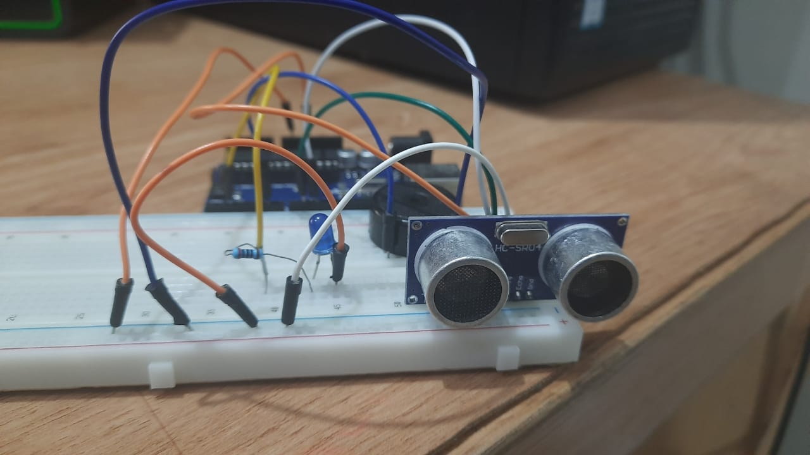

# Arduino-Ultrasonic-Sensor
Buzzing and led getting lit  based on distance from ultrasonic sensor.
## Preview

## Material needed
1 x Arduino Board
1 x Ultrasonic Sensor
1 x Led
1 x Buzzer
1 x 220 Ohm resistor
Jumper Wires
## Getting Started
Download the repository in your local machine and execute the code in your Arduino IDE
after building the circuit.

Have fun :)
